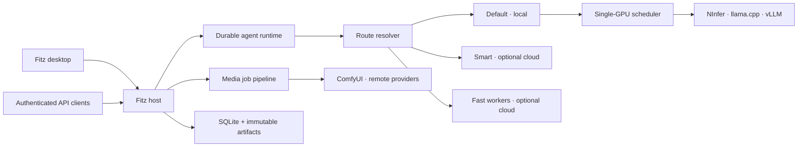

<!-- README.md -->

<div align="center">

# Fitz Harness

### A local-first agent desktop with its own inference control plane.

**Run durable coding agents, local models, optional cloud routes, and media generation through one inspectable Windows host.**

[](https://nodejs.org/)
[](https://pnpm.io/)
[](https://www.microsoft.com/windows/windows-11)
[](docs/implementation-status.md)

[Start Here](#start-here) • [Why Fitz Harness?](#why-fitz-harness) • [How It Works](#how-it-works) • [Development](#development) • [Documentation](#links) • [GitHub](https://github.com/yafitzdev/fitz-harness)

</div>

<br />

> [!IMPORTANT]
> Fitz Harness is preview software under active development. It is Windows-first,
> expects a developer-managed local inference environment for real local models,
> and is not yet a signed general-availability desktop release.

---

<a id="start-here"></a>

### Where to start 🚀

The fastest path uses the deterministic fake engine, so you can explore the
desktop and agent workflow without installing a model runtime first.

```powershell
git clone https://github.com/yafitzdev/fitz-harness.git
cd fitz-harness
corepack enable
pnpm install
pnpm check
pnpm dev:fake
```

In a second terminal:

```powershell
pnpm --filter @fitz/desktop start
```

You need Git, Node.js `22.19` or newer, and pnpm `11.9.0`. Replace
`pnpm dev:fake` with `pnpm dev` when the local NInfer environment and Default
model are configured.

---

### About

Fitz Harness turns one Windows machine into both an agent workstation and a
controlled inference host.

The Electron desktop provides persistent projects and chats, streaming agent
runs, tool activity, approvals, artifacts, media previews, model selection, and
long-session context management. Behind it, the Fitz host owns model routing,
GPU scheduling, engine lifecycle, durable state, authentication, storage, and
recovery.

Local inference can stay on the machine. When configured, owner-scoped
OpenAI-compatible connections add optional Smart and Fast routes without
changing the agent or desktop contract. NInfer, llama.cpp, vLLM, ComfyUI, and
future runtimes sit behind adapters rather than leaking engine-specific details
into the user experience.

Yan Fitzner — ([LinkedIn](https://www.linkedin.com/in/yan-fitzner/), [GitHub](https://github.com/yafitzdev), [Hugging Face](https://huggingface.co/yafitzdev)).

---

### Why Fitz Harness?

**One harness for agents and inference 🧰**
> The same host coordinates conversations, tools, model routes, GPU work,
> media jobs, artifacts, and remote consumers. The desktop does not need to
> understand how an individual engine starts or where it listens.

**Stable routes, replaceable engines 🔀**
> Users choose Default, Smart, or Fast. Administrators can change the recipe or
> provider behind a route without rewriting the agent loop or reconnecting every
> client.

**Durable and recoverable by design ♻️**
> Sessions, transcripts, run events, approvals, snapshots, artifacts, and queue
> state are persisted while work happens. Interrupted work becomes inspectable
> state instead of disappearing.

**Resource-aware local execution 🎛️**
> One owner-fair scheduler coordinates model-bearing GPU work. Fitz warms the
> local Default model, applies RAM/VRAM admission policy, prevents competing
> local engines from thrashing the GPU, and restores Default after local media
> temporarily displaces it.

**Private first, remote when invited 🔐**
> Engines bind to loopback, credentials stay outside renderer JavaScript, and
> remote access is opt-in and authenticated. Public consumers cannot reach host
> administration or host tools.

---

<a id="how-it-works"></a>

### How It Works



| Route | Purpose | Execution |
|-------|---------|-----------|
| **Default** | Private, host-owned agent work | Local engine selected by the administrator |
| **Smart** | Optional high-capability main work and bounded peer delegation | Owner-scoped OpenAI-compatible connection |
| **Fast** | Optional inexpensive main work or delegated worker tasks | Owner-scoped OpenAI-compatible connection |

Agent effort controls delegation independently from output length. Local work
remains constrained by loaded context and GPU capacity; cloud work runs through
a separate bounded lane.

---

<a id="development"></a>

<details>

<summary><strong>📦 Development</strong></summary>

<br />

#### Common commands

| Command | What it does |
|---------|--------------|
| `pnpm install` | Install the pinned workspace dependencies |
| `pnpm check` | Run TypeScript typechecking and the complete test suite |
| `pnpm dev:fake` | Start the development host with deterministic fake inference |
| `pnpm dev` | Start the development host with the real NInfer configuration |
| `pnpm --filter @fitz/desktop start` | Build and open the Electron desktop |
| `pnpm smoke` | Build and smoke-test the host |
| `pnpm desktop:dist:win` | Build and smoke-test the Windows NSIS installer |

The development host binds to `127.0.0.1:8787` by default. Set `FITZ_PORT` to
use another port. Development keeps mutable state inside the repository:

```text
data/
├── database/    SQLite state
├── artifacts/   content-addressed payloads
├── backups/     verified database + artifact backups
├── pi/          managed Pi packages
├── logs/        host and engine logs
└── cache/       runtime cache and generated output
```

Production stores mutable application state beneath
`%LOCALAPPDATA%Fitz Harness`. The canonical local inference registry lives at
`/opt/fitz/llm` inside the managed `Fitz-Inference` WSL distribution.

</details>

---

<details>

<summary><strong>📦 Architecture</strong> → <a href="DESIGN.md">Product and Technical Design</a></summary>

<br />

```text
Electron desktop and authenticated clients
                    │
                    ▼
Fitz host: identity · sessions · agents · routing · storage · observability
        ├───────────┴───────────┐
        ▼                       ▼
Agent runtime              Inference control plane
Pi adapter                 routes · queue · lifecycle
context + compaction       resource policy · leases
tools + approvals          text and media adapters
        └───────────┬───────────┘
                    ▼
SQLite metadata · immutable artifacts · verified backups
```

The repository is a pnpm TypeScript monorepo. Product boundaries live in
workspace packages: protocols, storage, security, inference policy, engine
adapters, media, connectivity, context management, and the Pi agent adapter.
The host composes those packages; the desktop communicates only through Fitz
protocols.

For the generated package and API inventory, open the
[Project Overview](docs/project-overview.html).

</details>

---

<details>

<summary><strong>📦 Packaging and Updates</strong> → <a href="docs/windows-packaging.md">Windows Packaging Guide</a></summary>

<br />

```powershell
pnpm desktop:dist:win
```

The packaging pipeline builds the host, embeds it in the Electron application,
creates the NSIS installer, and runs the packaged-desktop smoke test. Tagged
releases can publish installer metadata consumed by `electron-updater`.

Application updates replace program files only. Chats, settings, extensions,
logs, artifacts, engines, and models remain outside the installation directory.
A Windows code-signing certificate is still required before broad distribution.

</details>

---

### Project status

The core host, desktop shell, Pi-backed agent runtime, local/cloud routing,
single-GPU scheduling, security boundary, durable storage, artifacts, media
jobs, recovery, packaging, and automated test coverage are implemented.

The project is still refining desktop UX, accessibility, schema generation,
provider validation, and release hardening. See
[Implementation Status](docs/implementation-status.md) for the detailed split
between implemented and deferred work, and [TODO.html](TODO.html) for active
work.

---

<a id="links"></a>

### Links

- [GitHub](https://github.com/yafitzdev/fitz-harness)
- [Product and Technical Design](DESIGN.md)
- [Generated Project Overview](docs/project-overview.html)
- [Implementation Status](docs/implementation-status.md)
- [Desktop Shell](docs/desktop.md)
- [Runtime Contract](docs/runtime-contract.md)
- [Model Residency](docs/model-residency.md)
- [Engine Adapters](docs/engine-adapters.md)
- [Agent and Tool Model](docs/collaboration-model.md)
- [Context Management](docs/context-management.md)
- [Configuration](docs/configuration.md)
- [Security](docs/security.md)
- [Artifacts and Backups](docs/artifacts.md)
- [Media Generation](docs/media-generation.md)
- [Windows Packaging](docs/windows-packaging.md)
- [Test Matrix](docs/test-matrix.md)

---

> Fitz Harness takes interaction inspiration from coding-agent desktop tools,
> including Codex, but is not affiliated with or endorsed by OpenAI.
