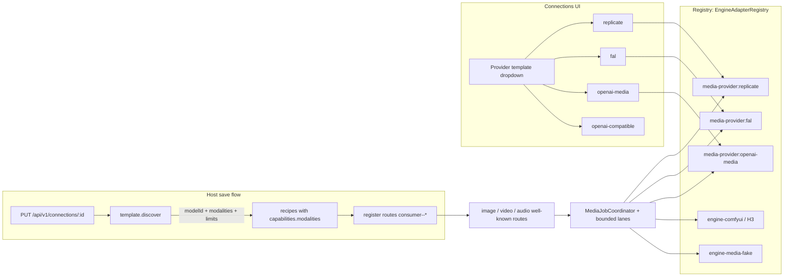

# Media Generation for Fitz — Image / Video / Audio

| | |
| --- | --- |
| **Title** | Media generation (image / video / audio) for Fitz |
| **Author** | Fitz architecture (placeholder) |
| **Date** | 2026-08-08 |
| **Status** | Historical design record — implementation landed |
| **Related docs** | `docs/media-generation.md` (brainstorm draft), `docs/engine-adapters.md`, `docs/pi-adapter.md`, `docs/artifacts.md`, `DESIGN.md`, `docs/implementation-status.md` |

> This file preserves the original media architecture and rollout rationale. For current text routing and residency behavior, `docs/model-residency.md` and `docs/engine-adapters.md` are normative.

---

## Overview

Fitz is a chat + coding-agent control plane with embedded image/video/audio generation and editing. Text routing now has one host-owned local `default` plus optional consumer-owned cloud `fast` and `smart` selections; `fast` also powers delegated workers. Media keeps the well-known `image`, `video`, and `audio` routes and renders generated artifacts in chat and the Inspector.

This design adds image, video, and audio generation by generalizing the existing playbook/recipe/routing/connection/artifact infrastructure rather than building a parallel system:

1. **Local media engines** are hosted exactly like chat engines — playbook folder, recipe with lifecycle, on-demand load, idle eviction, leases, health checks. First engine: **MiniMax H3** (Hailuo 3.0) via ComfyUI.
2. **Cloud media providers** are added in Connections exactly like cloud LLM APIs — paste a key, models are discovered with modality metadata, routes are assigned.
3. **Routing is generalized**: routes gain a `kind` (`chat` | `image` | `video` | `audio`); media adds well-known single-assignment routes `image`, `video`, `audio`.
4. The **Pi agent** gets `generate_image` / `generate_video` / `generate_audio` tools: the agent says *what*, routing decides *where*.
5. Generated media lands in the existing artifact store and renders in the existing Inspector (image/audio/video rendering already exists) with size handling as the only new display work.

The single biggest hidden cost is that **cloud media APIs are not OpenAI-compatible chat**. The generic chat connection flow (base URL + `/v1/models` + chat capabilities) does not transfer, so this design introduces a **provider template** layer (`packages/media-providers`) that normalizes `openai-media`, `fal`, and `replicate` to Fitz's own media job DTOs — the same containment argument as engine adapters.

---

## Background & Motivation

**Current state (verified in code):**

- `packages/protocol/src/domain.ts` defines `EngineCapabilities` (lines 16–26) with six chat-only booleans (`chatCompletions`, `streaming`, `toolCalls`, `responseFormat`, `minP`, `maxConcurrentGenerations`), `Recipe` (lines 32–42), and `Route { id, displayName, description?, recipeId, enabled, isDefault? }` (lines 62–71).
- `packages/inference-core/src/adapter.ts` defines `EngineAdapter` — a chat-shaped contract (`prepare?`, `validateRecipe`, `estimateResources`, `buildLaunchSpec`, `start`, `waitUntilReady`, **`streamChat`**, `stop`, `inspect`) plus `EngineAdapterRegistry`.
- `packages/inference-core/src/scheduler.ts` is the strict single-GPU owner-fair scheduler for chat, media, recipe tests, and VRAM-bearing warmup (`QueueJob`, leases, cancellation, `queue.updated` events). Owners rotate round-robin while each owner's work remains FIFO. `packages/inference-core/src/lifecycle-manager.ts` implements on-demand load, leases (active work blocks eviction), idle TTL, and the `ResourceGovernor` VRAM reserve (default 2048 MiB, `packages/inference-core/src/resources.ts`). CPU/RAM-only preparation may run concurrently, but model activation cannot bypass the queue.
- `apps/host/src/create-app.ts` exposes `GET /v1/models`, `POST /v1/chat/completions`, the native agent-run API, management endpoints (`PUT /api/v1/management/routes/:id`, recipe test), and the owner-scoped consumer-connection flow: `PUT /api/v1/connections/:connectionId` → discovery → private recipes. Text recipes bind through `/api/v1/cloud-routes/:role`; media recipes retain concrete media routes.
- `apps/desktop/src/ui/connections/connection-workspace.ts` renders local Default assignment separately from consumer-owned Smart and Fast-worker cloud bindings, plus the media-route controls.
- `packages/media/src/registry.ts` already classifies `image`/`audio`/`video`/`pdf`/`code`/`text`/`binary`; the Inspector renders artifacts via `data:<mime>;base64,<payload>` (`apps/desktop/src/ui/inspector/resource-inspector.ts:130–134`).
- `ArtifactRepository` stores SHA-256, MIME classification, ownership, and an opaque object reference in SQLite while payloads live in the managed content-addressed directory. The 5 MB HTTP upload cap still applies to user uploads; generated media uses coordinator-enforced kind-aware caps (§5.11) and streams directly into the blob backend.
- Security: administrator/agent/consumer roles, per-user route grants (`route.use:<id>`), `UserQuota` (`packages/protocol/src/security.ts`), tool approval gating (Full access / Ask first / Read only), secrets in credential env vars (never in recipes).

**Pain points driving the change:**

- Users must leave Fitz (or the agent must shell out to scripts) to generate images/video/audio; the artifact/Inspector infrastructure that could render results is idle.
- H3 (open-weights, 2026-07-31) and fal/Replicate all *host* generation, but nothing in Fitz can express "a recipe that outputs video" or "a route that means video".
- The chat capability model and the chat-only adapter contract are structurally incapable of describing generation jobs (submit/poll, progress, long leases, byte results).

---

## Goals & Non-Goals

### Goals (v1)

1. Local media engines hosted/managed exactly like chat engines (managed or external process, recipe lifecycle, on-demand load, idle eviction, leases, health checks, resource governor refusal).
2. Cloud media providers added in Connections exactly like cloud LLM APIs (paste key, discover models + modality metadata, assign routes), behind a provider-template abstraction.
3. Routing generalized: `Route.kind`, well-known media routes `image` / `video` / `audio`, single-assignment per route (v1), modality-matching validation on assignment.
4. Pi agent tools `generate_image` / `generate_video` / `generate_audio` with Ask-first-by-default gating and per-user media quotas.
5. Generated media written to the existing artifact store and rendered by the existing Inspector, with size/cap handling for large video.
6. A deterministic fake media engine so the entire loop is testable without a GPU.

### Non-Goals (v1)

- Priority/fallback route lists (route → ordered recipes). Single-assignment `Route.recipeId` stays.
- A public media-generation API beyond the OpenAI-shaped gateway (`/v1/images/generations`, `/v1/videos/generations`; §5.8 — consumed by Fitz's own clients only).
- Image editing / inpainting as first-class tasks (the DTOs keep a `refs` array so image-to-video and reference editing can slot in later).
- TTS vs. music vs. SFX differentiation; the `audio` route is a single slot until audio ships as a user-facing route/tool.
- H3 2K/15s video on the local 32 GB VRAM host (768p/1K-class locally; 2K is a cloud path).
- Resuming interrupted media jobs after host restart (they are marked `interrupted`; provider-side cancel-on-restart is a follow-up).
- Content moderation of generated output (flagged in Security; provider terms apply for cloud; local engines are unmoderated).

---

## Key Decisions

| # | Decision | Rationale |
| --- | --- | --- |
| KD-1 | First local engine: **MiniMax H3** (Hailuo 3.0), text→video / first-last-frame→video / multimodal-reference→video, native stereo audio output. | Open weights, current, officially outputs video + audio only. |
| KD-2 | H3 **does not serve the `image` route**. Fitz registers only the official H3 video recipe; the `image` route gets its own engine. | H3 has no official text→still-image task, so the control plane does not invent one. |
| KD-3 | Cloud provider order: 1) generic **OpenAI-compatible media** (`/v1/images/generations`, `/v1/videos/generations`), 2) **fal**, 3) **Replicate**. Both fal and Replicate host H3 — the natural cloud path for 2K video. | Reuses the existing auth/transport pattern first; first-class adapters for the H3 hosts. |
| KD-4 | **Hardware**: 32 GB VRAM host. H3 runs locally at 768p/1K-class; 2K/15s is cloud territory. Recipes declare VRAM estimates; the existing `ResourceGovernor` (2048 MiB reserve) refuses load as the safety net. | Unverified 2K VRAM until a real run; governor + estimates are the safety net. |
| KD-5 | **Single-assignment per route** for v1 (`Route.recipeId`, matching today's schema). Priority/fallback lists later. | Matches existing schema and UI; no new routing policy machinery. |
| KD-6 | **Audio deferred as a user-facing route/tool**, but capability model + job DTOs include audio now (H3 natively outputs stereo audio). | Schema must not need a later refactor. |
| KD-7 | **Access control**: media tools default **Ask first** in *every* access mode, including Full access — Full access never auto-allows media tools (the policy engine returns `ask`/`block` for them, and the legacy no-policy gates escalate too; Read only keeps blocking non-read-only tools) — plus per-user media quotas (job count + credit budget). Generation costs money. | Money + minutes-long GPU/cloud work justifies stronger-than-default gating. |
| KD-8 | **Jobs, not streams**: generation is submit + poll with a durable job record, long leases, progress events, restart recovery. | Local engines (ComfyUI `/prompt` → `/history`) and clouds both expose async job ids; there is no token stream to stream. |
| KD-9 | **Explicit bounded resource lanes**: one owner-fair lane with concurrency one for every local GPU operation, plus an owner-fair bounded concurrent lane for remote provider media. | A single GPU can never process two requests concurrently, and a user burst cannot indefinitely delay another owner. Remote media does not consume VRAM, block local chat, or switch the local lifecycle recipe. Both lanes retain queue visibility and cancellation. |
| KD-10 | **Separate `MediaEngineAdapter` interface** rather than adding generation methods to `EngineAdapter`. | `streamChat` and `submit/poll/cancel` have different shapes, lifetimes, and error semantics; one interface per job kind keeps the registry and lifecycle type-safe. |
| KD-11 | **Provider templates** (`packages/media-providers`), not a chat-shaped adapter, for cloud media. | Cloud media APIs are not OpenAI-compatible chat — this is the biggest hidden cost; templates are the containment boundary (same argument as engine adapters). |
| KD-12 | Media tool calls **never block the agent turn on job completion**. The tool submits and returns a `mediaJobId`; completion lands in the artifact repo and event stream. | The agent's own chat *is* a scheduler queue job; blocking on a queued media job behind it would deadlock the turn. |
| KD-13 | **H3 weight placement:** the upstream ComfyUI checkout stays clean under `.llm/engines/ComfyUI`; weights live under `.llm/models/comfyui`, the isolated Python environment under `.llm/environments/comfyui-python`, and Fitz points ComfyUI at them with an external YAML config. | Preserves the single `.llm` source of truth without polluting an engine Git checkout. See `docs/h3-local-video.md`. |

---

## Proposed Design

### 5.1 Modality capability matrix

`EngineCapabilities` keeps its chat booleans (they remain the source of truth for chat routes) and gains an **additive optional** `modalities` field. A recipe's `output` array determines which media routes it is assignable to.

```ts
// packages/protocol/src/domain.ts
export type MediaModality = "image" | "video" | "audio";
export type ModalityInput = "text" | "image" | "video" | "audio";

export interface ModalityCapabilities {
  /** Modalities the engine accepts as input (prompt refs / reference editing). */
  input: ModalityInput[];
  /** Modalities the engine can generate. */
  output: MediaModality[];
  /** Generation-specific limits, where the engine declares them. */
  limits?: {
    maxDurationSeconds?: number;
    maxResolution?: string;   // e.g. "768x768", "1280x720", "2560x1440"
    maxRefs?: number;         // H3 accepts up to 12 multimodal refs
    maxFrames?: number;
  };
}

export interface EngineCapabilities {
  chatCompletions: boolean;
  streaming: boolean;
  toolCalls: boolean;
  responseFormat: boolean;
  minP: boolean;
  maxConcurrentGenerations: number;
  modalities?: ModalityCapabilities; // new — absent ⇒ chat-only recipe
}
```

Capability matrix for the v1 lineup:

| Recipe | input | output | limits | Assignable routes |
| --- | --- | --- | --- | --- |
| Chat models (local/cloud) | text | — (no `modalities`) | — | local `default`; cloud `fast` or `smart` binding |
| H3 FL2VA local (ComfyUI) | text (first/last-frame conditioning follows) | video with stereo audio | ≤ 15 s, ≤ 1344x768 local | `video` |
| Dedicated image engine (e.g. SD-class local or provider) | text, image | image | — | `image` |
| DALL·E-class provider model | text | image | — | `image` |

Recipe `configuration` gains optional media keys validated by the media adapter: `comfyuiWorkflow` (workflow JSON/graph file), `outputFormats` (`["png","jpg"]`, `["mp4","webm"]`, `["wav","mp3"]`), `defaults` (sampler, steps, guidance, resolution, fps, duration cap), and `costCentsPerJob?: number` (credit accounting, §5.9).

### 5.2 `Route.kind`

```ts
// packages/protocol/src/domain.ts
export type RouteKind = "chat" | "image" | "video" | "audio";

export interface Route {
  id: string;
  displayName: string;
  description?: string;
  recipeId: string;
  kind: RouteKind; // new; defaults to "chat"
  enabled: boolean;
  isDefault?: boolean;
}
```

- Public chat keeps `default` plus optional `fast` and `smart`; effort independently controls child capacity (none at Light, route-specific Fast children at Normal/High, and the optional concurrent Smart peer only for High Smart turns). Media adds exactly three **well-known route ids**: `image`, `video`, `audio`.
- Media routes are created **disabled with an empty `recipeId: ""`** by an idempotent `ensureMediaRoutes()` at host startup and after any media-capable recipe upsert. It is **create-only**: existing media routes are never reset — their `recipeId`/`enabled` state is preserved on every boot. `RouteResolver.resolve()` only resolves *enabled* routes, so an unassigned media route is inert.
- **Assignment** stays on the existing `PUT /api/v1/management/routes/:id` handler: it gains validation that the recipe's `modalities.output` includes the route's kind. The modality check applies **only when the request assigns a recipe** (`enabled: true` with a non-empty `recipeId`) — it must never block a de-assignment.
- **De-assignment (explicit rollback path)**: for media routes, `PUT /api/v1/management/routes/:id` accepts an **empty `recipeId`**, which persists `enabled: false` (the route stays visible and disabled rather than being deleted). This requires two coordinated changes in `model-management-routes.ts`, not just `parseRoute`: (a) `parseRoute` is relaxed for `kind !== "chat"` — empty `recipeId` is legal for media routes and implies `enabled: false` (chat routes keep the current non-empty-`recipeId` requirement); and (b) the `PUT /routes/:routeId` handler's **independent recipe-exists guard** **skips the check when `recipeId === ""`** — a de-assignment deliberately references no recipe, so without (b) the de-assignment `PUT { recipeId: "", enabled: false }` still returns 400. `enabled: false` with a non-empty `recipeId` remains valid (assign-but-disable).
- **Visibility of disabled media routes**: `RouteResolver.listRoutes()` currently returns *enabled routes only* (route-resolver.ts:63–66), and every management surface (`GET /api/v1/management/routes`, management status, desktop configuration load) reads it — a de-assigned media route would otherwise be invisible and un-restorable. `RouteResolver` gains `listRoutes(includeDisabled?: boolean)`; the management route listing and the desktop Media routes section pass `includeDisabled: true` so a disabled-but-assigned `image`/`video`/`audio` route is observable and can be re-assigned from the UI.
- **Boot safety (ninfer mode)**: `reconcileNInferConfiguration` (apps/host/src/server.ts:163–171) runs before `createHost()` at every boot in the default `FITZ_ENGINE_MODE ?? "ninfer"` and deletes every route that is not `consumer--*` and not a ninfer playbook template — which would include the well-known media routes. Two changes make assignments survive restarts: (1) the reconcile **exempts the well-known media route ids** (`image`/`video`/`audio`), and (2) `ensureMediaRoutes()` preserves existing `recipeId`/`enabled` state (above). A regression test covers boot-after-assignment in ninfer mode: assign a recipe to `image`, restart the host, assert the route is still assigned and enabled.
- `RouteResolver.resolve()` is unchanged for chat. The media gateway additionally validates `route.kind` matches the requested modality before enqueueing.

### 5.3 Media job model: submit / poll / cancel

Generation is a **job**, not a token stream. New durable record in SQLite (alongside `inference_requests`):

```ts
// packages/protocol/src/media.ts (new, exported from index.ts)
export type MediaJobStatus =
  | "queued" | "started" | "progressing"
  | "completed" | "failed" | "cancelled" | "interrupted";

export interface MediaGenerationParams {
  prompt: string;
  negativePrompt?: string;
  /** image-to-video / reference editing. `url` may be a provider URL or a Fitz artifact download URL. */
  refs?: Array<{ artifactId: string } | { url: string }>;
  size?: string;              // "1024x1024", "768x768", "1280x720", ...
  durationSeconds?: number;
  fps?: number;
  seed?: number;
  sampler?: string;
  steps?: number;
  guidance?: number;
  // Provider-specific extras ride in `configuration`-validated keys.
}

export interface MediaGenerationRequest {
  id: string;
  routeId: string;
  modality: "image" | "video" | "audio";
  params: MediaGenerationParams;
  userId?: string;
}

export interface MediaGenerationResult {
  /** Content bytes or a provider download URL; the coordinator resolves to bytes. */
  data: Uint8Array | { url: string };
  mimeType: string;
  byteSize: number;
  durationSeconds?: number;
  width?: number;
  height?: number;
}

export interface MediaJobRecord {
  id: string;
  sessionId?: string;
  routeId: string;
  modality: "image" | "video" | "audio";
  status: MediaJobStatus;
  params: MediaGenerationParams;
  progress?: number;          // 0..1
  artifactId?: string;        // set on completion, via SqliteStore.createArtifact
  providerJobId?: string;     // opaque engine/provider job ref (polling/cancel across processes)
  errorCode?: string;
  enqueuedAt: string;
  startedAt?: string;
  completedAt?: string;
  cancelledAt?: string;
  createdByUserId?: string;
  creditCostCents?: number;   // recipe.configuration.costCentsPerJob at submit time
}

/** Events yielded by the queue slot and persisted by the coordinator.
 *  Sequence numbers live in the `media_job_events` table (PK `(job_id, sequence)`),
 *  mirroring `agent_events` (sqlite-store.ts:439) — the event DTOs carry no sequence
 *  field. SSE replay (`GET /api/v1/media/jobs/:id/events` with After / Last-Event-ID)
 *  reads rows in sequence order, exactly like agent-run events. */
export type MediaJobEvent =
  | { type: "progress"; progress: number }
  | { type: "completed"; result: MediaGenerationResult }
  | { type: "failed"; error: string }
  | { type: "cancelled" };
```

Semantics:

- **Submit** creates the durable record (`queued`) before scheduler admission, then enters the lane selected from the adapter execution location. **Poll** is driven by the lane's per-job loop, yielding `progress` events. **Cancel** works at both queue position and in-flight boundaries (engine/provider cancel API, mirroring ComfyUI `/queue` or Replicate `/v1/predictions/{id}/cancel`). Jobs **never** stream tokens.
- **v1 desktop consumption is HTTP polling**: the Inspector polls `GET /api/v1/media/jobs/:id` (optionally `?status=` to filter), exactly as the desktop consumes agent runs today. The job SSE stream (`GET /api/v1/media/jobs/:id/events`) is for **external clients and event replay**, not the desktop renderer: `window.fitz.request` (apps/desktop/src/main.ts) is a single-response `fetch` that buffers the full response body in both `text` and `base64` modes and cannot consume `text/event-stream`, and the renderer CSP is `connect-src 'none'`. Live push progress in the Inspector would require an IPC streaming bridge; that is a later, separately budgeted change, not a v1 requirement.
- **Restart recovery**: on host boot, `store.recoverInterruptedMediaJobs()` marks `queued|started|progressing` → `interrupted` (errorCode `host_restarted`), matching `recoverInterruptedRequests()` in `sqlite-store.ts`. Because `providerJobId` is persisted, a follow-up can issue provider-side cancels for orphaned cloud jobs.

### 5.4 `MediaEngineAdapter` interface

A second adapter interface in `packages/inference-core/src/adapter.ts`, sharing the lifecycle primitives with `EngineAdapter` but replacing `streamChat` with job-oriented generation:

```ts
// packages/inference-core/src/adapter.ts
export interface MediaJobHandle {
  id: string;                       // engine/provider-side job id
  modality: "image" | "video" | "audio";
}

export interface MediaJobPoll {
  status: "queued" | "started" | "progressing" | "completed" | "failed" | "cancelled";
  progress?: number;                // 0..1
  result?: MediaGenerationResult;   // present only when status === "completed"
  error?: string;
}

export interface MediaEngineAdapter<THandle extends EngineInstanceHandle = EngineInstanceHandle> {
  readonly id: string;
  readonly modalities: Array<"image" | "video" | "audio">;
  /** Recommended poll interval for this engine/provider (default 1000 ms). */
  readonly defaultPollIntervalMs?: number;
  prepare?(recipe: Recipe, signal: AbortSignal): Promise<void>;
  validateRecipe(recipe: Recipe): Promise<ValidationReport>;
  estimateResources(recipe: Recipe): Promise<ResourceEstimate>;
  buildLaunchSpec(recipe: Recipe, allocation: PortAllocation): Promise<LaunchSpec>;
  start(recipe: Recipe, spec: LaunchSpec, signal: AbortSignal): Promise<THandle>;
  waitUntilReady(instance: THandle, signal: AbortSignal): Promise<ReadyInfo>;
  submit(instance: THandle, request: MediaGenerationRequest, signal: AbortSignal): Promise<MediaJobHandle>;
  poll(instance: THandle, job: MediaJobHandle, signal: AbortSignal): Promise<MediaJobPoll>;
  cancel(instance: THandle, job: MediaJobHandle): Promise<void>;
  stop(instance: THandle, mode: StopMode): Promise<StopReport>;
  inspect(instance: THandle): Promise<InstanceInspection>;
}

export function isMediaEngineAdapter(adapter: EngineAdapter | MediaEngineAdapter): adapter is MediaEngineAdapter {
  return typeof (adapter as MediaEngineAdapter).submit === "function";
}
```

- `EngineAdapterRegistry` keeps one id-keyed map; `get(id)` stays the chat path, a new `getMedia(id)` narrows with `isMediaEngineAdapter` and throws `Unknown media adapter` otherwise. `LifecycleManager` gains a `#mediaAdapter` accessor used only by `runMedia`.
- **Implementors**: `engine-media-fake` (deterministic image/video/audio bytes), `engine-comfyui` (H3; launches/stops the ComfyUI server — managed or external, exactly like llama.cpp — and drives `/prompt` → `/history/{id}` with progress from the websocket or `/progress`), and the cloud provider adapters (which implement `start`/`waitUntilReady` as no-ops over an external endpoint — the same pattern as `OpenAICompatibleEngineAdapter`, whose `start()` validates credentials and returns a handle without launching a process).
- This is why a single `MediaEngineAdapter` interface covers **both** local engines and cloud providers: route resolution, the scheduler, the coordinator, the job DTOs, and cancellation are identical; only the HTTP payloads differ.

### 5.5 Scheduler + lifecycle integration

`packages/inference-core/src/scheduler.ts` owns two bounded resource lanes. Chat, warmup, recipe tests, and local media enter the permanent one-slot GPU lane. Remote media enters the bounded cloud lane:

```ts
// packages/inference-core/src/scheduler.ts
export interface ScheduledMediaJob {
  jobId: string;
  events: AsyncIterable<MediaJobEvent>;
  cancel(): void;
}

export class InferenceScheduler {
  enqueueMedia(
    routeId: string,
    input: Omit<MediaGenerationRequest, "id" | "routeId">,
    externalSignal: AbortSignal | undefined,
    options: { jobId: string; context?: WorkContext },
  ): ScheduledMediaJob;
}
```

- `QueueJob` is a discriminated union of chat, media, and warmup admissions. `BoundedWorkLane` supplies queue position, cancellation, shutdown, and backpressure uniformly; the scheduler selects GPU or cloud before admission. Recipe tests use chat admissions with forced post-test unload.
- `LifecycleManager` gains:

```ts
async *runMedia(recipe: Recipe, request: MediaGenerationRequest, signal: AbortSignal): AsyncIterable<MediaJobEvent> {
  await this.#ensureReady(recipe, signal);            // on-demand load + governor refusal
  const adapter = this.#mediaAdapter(recipe);
  this.#cancelEviction();
  this.#activeLeases += 1;
  this.#transition("BUSY", "media-generation-started");
  try {
    const job = await adapter.submit(this.#handle!, request, signal);
    for (;;) {
      const poll = await adapter.poll(this.#handle!, job, signal);
      if (poll.status === "completed" && poll.result) { yield { type: "completed", result: poll.result }; return; }
      if (poll.status === "failed") throw new Error(poll.error ?? "Media generation failed");
      if (poll.status === "cancelled") throw abortError();
      if (poll.progress !== undefined) yield { type: "progress", progress: poll.progress };
      await abortableDelay(adapter.defaultPollIntervalMs ?? 1_000, signal);
    }
  } catch (error) {
    if (isAbortError(error)) await adapter.cancel(this.#handle!, job);   // best-effort provider cancel
    if (!isAbortError(error)) { this.#failureReason = errorMessage(error); this.#transition("FAILED", "media-generation-failed"); }
    throw error;
  } finally {
    this.#activeLeases = Math.max(0, this.#activeLeases - 1);
    this.#lastActivityAt = this.#clock.now();
    if (this.#state === "BUSY") { this.#transition("READY", ...); this.#scheduleEviction(); }
  }
}
```

- **Lease semantics need no policy changes**: `#scheduleEviction()` fires only when `activeLeases === 0` and the instance is READY, so a 5-minute video holds its lease to the terminal state — exactly the existing behavior exercised harder. Media recipes declare `evictionPolicy: "immediate"`, releasing media VRAM as soon as generation ends so the queued text model can load for refinement.
- **Local policy**: a local video job holds the only GPU lane; local chat, warmup, tests, and other local media wait behind it. This is the hard single-GPU safety contract.
- **Remote-provider policy**: remote media uses a bounded cloud lane. It never calls the local lifecycle manager, never evicts a resident model, and does not delay the local GPU queue. Its provider handle remains cancellable and its durable job uses the same visible queue identity.
- **`queue.updated` must not leak non-chat jobs into `inference_requests`**: its job-kind discriminator is `"chat" | "media" | "warm"` and its lane is `"gpu" | "cloud"`. Only GPU-lane events enter `gpu_work_items`; media retains its richer `media_jobs` record and event stream. This prevents duplicate recovery, keeps cloud work out of the GPU ledger, and makes warmup admission observable without pretending it is a chat request.

### 5.6 Host media job service — `apps/host/src/media-jobs.ts`

`MediaJobCoordinator` mirrors `AgentRunCoordinator` (`apps/host/src/agent-runs.ts`): durable records, sequenced events, SSE replay, cancellation, restart recovery.

```
submit(request, principal)
  ├─ resolve route (RouteResolver.resolve) → route + recipe
  ├─ validate: route.kind === request.modality
  │            && recipe.capabilities.modalities?.output.includes(request.modality)
  ├─ authorize: principal.routeGrants includes route.id (existing route.use:<id> grants)
  ├─ quota: security.enforceMediaQuota(principal, request)   // §5.9
  ├─ store.createMediaJob({ status: "queued", creditCostCents })
  ├─ scheduler.enqueueMedia(routeId, request) → ScheduledMediaJob
  ├─ subscribe: persist status/progress transitions
  │             on completed → resolve result.data to bytes (fetch provider URL or decode b64)
  │                           → artifacts.create(draft, stream)         // external SHA-256 object, kind-aware cap §5.11
  │                           → attach artifactId, status=completed
  │             on failed/cancelled → persist errorCode/status
  ├─ return 202 { job }
```

Responsibilities: job persistence, the per-job poll subscription, progress event emission (both the job SSE stream and lifecycle `queue.updated` already cover queue position), artifact write-back on completion, credit ledger append, restart recovery, and quota enforcement. It is constructed with `{ store, scheduler, routes, security }` and registered in `createHost()` alongside the existing `agentRuns` coordinator. Principals enter two ways: HTTP submits use the existing `authenticate()` path (device-bearing `AuthenticatedPrincipal`), while the in-process agent-tool path supplies a device-less principal from `security.principalForUser(userId)` (§5.9).

**Endpoints** (all under the existing auth path; `GET /api/v1/events`-style sequencing):

```
POST   /api/v1/media/jobs                 submit   { routeId | model?, modality, params }
GET    /api/v1/media/jobs/:id             status + progress + artifactId
GET    /api/v1/media/jobs/:id/events      SSE replay (After / Last-Event-ID over `media_job_events` sequence, like agent runs; external/replay use — v1 desktop polls the status endpoint)
POST   /api/v1/media/jobs/:id/cancel      cancel (queued → in-place; running → adapter/provider cancel)
GET    /api/v1/media/jobs?status=&limit=  history (owner-scoped unless administrator)
```

### 5.7 Provider templates — `packages/media-providers`

Cloud media APIs are not OpenAI-compatible chat: no `/v1/models` that doubles as chat, keys and auth differ (`Key <key>` for fal), job shapes differ, and result payloads are URLs or base64 in different envelopes. The generic chat connection flow (`create-app.ts` lines 464–511) cannot be reused as-is for media. A **provider template** layer contains that divergence.

```ts
// packages/media-providers/src/provider.ts
export interface ProviderModel {
  modelId: string;
  modalities: MediaModality[];     // output modalities
  limits?: ModalityCapabilities["limits"];
}

export interface ProviderConnection {
  id: string;
  baseUrl: string;                 // template-defined default or user-supplied
  apiKeyEnv?: string;              // credential env name (FITZ_CONSUMER_<hash>)
  modelIds?: string[];             // for curated templates (fal/replicate)
}

export interface MediaProvider {
  readonly id: string;             // "openai-media" | "fal" | "replicate"
  /** Model discovery: probe endpoints or curated catalog. */
  discover(connection: ProviderConnection): Promise<ProviderModel[]>;
  submit(connection: ProviderConnection, request: MediaGenerationRequest): Promise<MediaJobHandle>;
  poll(connection: ProviderConnection, job: MediaJobHandle): Promise<MediaJobPoll>;
  cancel(connection: ProviderConnection, job: MediaJobHandle): Promise<void>;
}

export class MediaProviderRegistry {
  register(provider: MediaProvider): void;
  get(id: string): MediaProvider;
}
```

| Template | id | Endpoints | Notes |
| --- | --- | --- | --- |
| Generic OpenAI-compatible media | `openai-media` | `POST /v1/images/generations`, `POST /v1/videos/generations`, optional `/v1/audio/generations` | Reuses existing bearer-auth + `openAIEndpoint()` URL building (`openai-compatible-client.ts`). Images are synchronous (`{ data: [{ b64_json | url }] }`); videos may be sync or async (`{ id, status }` → poll), and the template handles both. |
| fal | `fal` | `POST https://queue.fal.run/<model>` → `{ request_id, status: "IN_QUEUE" }`; `GET .../requests/{id}` → result | `Authorization: Key <key>`. Curated model list (H3 video/audio, image models) with modality metadata; hosts H3 → natural 2K path. |
| Replicate | `replicate` | `POST https://api.replicate.com/v1/predictions` → `{ id, status, output: [urls] }`; `GET /v1/predictions/{id}`; `POST /v1/predictions/{id}/cancel` | Bearer key; hosts H3 → 2K path. Public catalog or curated list for discovery. |

**Host wiring (reuses the consumer-connection flow):**

- `PUT /api/v1/connections/:connectionId` switches on `body.template` (default `openai-compatible`). For media templates it calls `provider.discover(...)` instead of `listModels`, and for each `ProviderModel` creates a recipe with `adapter: <template id>`, `capabilities.modalities = { input, output, limits }`, `chatCompletions: false`, and `configuration: { baseUrl, apiKeyEnv, modelId }`.
- The host registers a thin `MediaProviderEngineAdapter` per template (id = template id) that implements `MediaEngineAdapter`: `start()` resolves the credential env (mirroring `OpenAICompatibleEngineAdapter.start`, which throws `Missing API key environment variable` when `apiKeyEnv` is set but empty), `waitUntilReady()` does a health probe, and `submit/poll/cancel` delegate to the `MediaProvider`. The recipe's `adapter` id therefore resolves in the **same** registry as local media engines — one code path in the scheduler/lifecycle, `isMediaEngineAdapter` narrows the interface.
- One connection may expose several modalities (fal has everything): discovery returns one recipe per model, and each recipe's `output` decides which routes it can be assigned to.
- **Mixed connections (media + chat over one connection)**: for media templates, the `PUT /api/v1/connections/:connectionId` handler runs **both** discovery paths and **unions the recipe sets** — the chat flow (`listModels` + `supportsChatCompletions`, creating `openai-compatible` text recipes) *and* `provider.discover(...)` (creating `<template id>` media recipes). A model that is both chat- and media-capable therefore yields two recipes — one per adapter. Text recipes can be bound to the owner's Smart or Fast role; media recipes can be assigned to compatible media routes.
- **Connection tracking and cleanup**: media discovery results are recorded in the connection registration so connection re-save/delete can clean them up. `ConsumerConnectionRegistration` (create-app.ts:51) gains a parallel **`mediaModels: Array<{ modelId, recipeId, routeId, modality, template }>`** list, populated by the media save flow for every discovered `ProviderModel` — mirroring how chat models populate `models` (create-app.ts:503–507). `removeConsumerRegistration` (create-app.ts:936–949) is extended to iterate `mediaModels` as well: it deletes the media recipes and their `consumer--*` routes, and **de-assigns** (never deletes) any well-known media route (`image`/`video`/`audio`) whose `recipeId` referenced a removed media recipe — `enabled: false`, `recipeId: ""`, keeping the route visible per §5.2. The same re-validation runs on connection re-save: after re-discovery, any well-known media route whose `recipeId` no longer resolves in `routes.listRecipes()` is cleared the same way, so a stale assignment can never keep pointing at a deleted recipe. PR 4 carries this with a connection re-save/delete test.
- Secrets stay in the existing credential env mechanism (`consumerCredentialEnvironment`); never in recipes. Provider result URLs are fetched **host-side** (§5.11) and never handed to the renderer.

### 5.8 OpenAI-shaped media gateway

`packages/protocol/src/openai.ts` (or the new `media.ts`) gains the serving/consuming DTOs — deliberately the same shapes Fitz serves and consumes. **Naming**: the gateway is "OpenAI-**shaped**", not wire-compatible with OpenAI: it mirrors OpenAI request/response field names where they exist, but the video shape and the error envelope are Fitz contracts, and only Fitz's own clients consume it (a public media-generation API is an explicit non-goal). Third-party OpenAI SDKs are not a target.

- `POST /v1/images/generations` `{ model: <routeId>, prompt, n?, size?, response_format?: "url"|"b64_json", user? }` → `{ created, data: [{ b64_json | url }] }`. **Synchronous** (submit + bounded await, e.g. 120 s). On timeout the endpoint returns **504 with a JSON error envelope that carries the job id**: `{ error: { message, type: "media_generation_timeout", param: <mediaJobId>, code: "media_generation_timeout" } }` — `OpenAIErrorResponse.error` already has optional `param`/`code` fields (packages/protocol/src/openai.ts:96–101), so this is a documented contract, not a schema change. The caller can continue polling `GET /api/v1/media/jobs/:id` with the returned job id.
- `POST /v1/videos/generations` `{ model, prompt, duration?, resolution? }` → **job-style** response `{ id: <mediaJobId>, object: "video.generation", status: "queued"|"started"|"progressing"|"completed"|"failed", ... }` (matches the async reality). **Video poll contract (documented here)**: status is polled via the Fitz-native `GET /api/v1/media/jobs/:id` — there is **no** `/v1/videos/generations/{id}` poll path in v1, and clients must not assume one. The `id` in the job-style response *is* the `mediaJobId`, so a Fitz client resumes the job through the native API (status, progress, artifact). A gateway-shaped poll path may be added later if a real external consumer appears.
- `POST /v1/audio/generations` — registered but returns 501 until the audio route exists (KD-6).
- The `openai-media` provider template (§5.7) is the reverse mapping: Fitz consumes these same shapes from third parties.

### 5.9 Agent tools, gating, and quotas

In `packages/agent-pi/src/pi-agent-runtime.ts`, three tools are registered through the existing `customTools` hook (wired in `apps/host/src/server.ts` where `customTools: safety.createCustomTools()` currently composes `fitz_trash` + sandboxed `bash`; the host composes a new `createMediaTools(mediaJobs)` alongside):

```
generate_image({ prompt, size?, seed?, negative_prompt?, refs?, route_id? })
generate_video({ prompt, duration_seconds?, resolution?, fps?, refs?, route_id? })
generate_audio({ prompt, duration_seconds?, route_id? })   // registered now, errors until audio route exists
```

Tool behavior:

- Resolves the **configured media route** (`image`/`video`/`audio` well-known ids; optional `route_id` lets the agent pick among granted routes). The agent never names an engine — routing is the admin's contract, exactly like chat.
- Calls the host media service **in-process** (the coordinator is constructed on the host; the tool gets a direct reference). The run's owner is resolved from the run context (`runId` → `agent_runs.owner_user_id`) so grants and quotas apply to the human, not the host. The tool path builds the principal via a new factory **`security.principalForUser(userId)`**, which resolves the user + `routeGrants` + quota with an **absent device** — the in-process path has no device (the run's creator may not be a paired device user), while `AuthenticatedPrincipal` (security-service.ts:10) normally derives the device from the token hash via `authenticate()`. `enforceMediaQuota(principal, request)` and the `route.use:<id>` authorization accept device-less principals; callers that tolerate an absent device (audit display, quota bookkeeping) simply see `device: undefined`.
- **Non-blocking by construction (KD-12)**: the tool submits and immediately returns `{ mediaJobId, status: "queued" | "started" }`. If the tool blocked awaiting completion, it would deadlock — the agent's own chat is a queue job ahead of the media job. Completion surfaces via the job SSE stream, the activity timeline, and the artifact repository.
- An optional read-only `media_job_status({ media_job_id })` tool (added to `READ_ONLY_TOOLS` alongside `fitz_session`) lets the agent check progress in a later turn; v1 ships without it if scope demands (OQ-5).

Gating (Ask-first in *every* access mode):

- `PiAgentRuntime.#evaluateTool` (pi-agent-runtime.ts lines 213–225) already funnels non-read-only tools through the host `toolPolicy` and then the human approval gate. Three concrete changes:
  1. `apps/host/src/agent-safety/policy.ts` gains an explicit case: `generate_image|generate_video|generate_audio` → `{ action: "ask" }` by default (it currently `recordAllow`s unknown tools, lines 100–102).
  2. **Per-tool policy override is resolved in the policy engine (option (a))**: the deterministic `evaluateToolCall` gains access to the store's `resolveToolPolicy(userId, role, toolName)` via `PolicyContext` — reusing the existing role/user-precedence resolution in `sqlite-store` unchanged. For the `MEDIA_TOOLS` names it maps the policy decision to a `ToolEvaluation` (the union at pi-agent-runtime.ts:28–32 is exactly `allow | block | rewrite | ask` — there is **no `deny` action**): decision `"allow"` → `{ action: "allow" }` (short-circuits to execution, no approval row, no human gate); decision `"deny"` → `{ action: "block", reason: "<tool> denied by policy" }` (rejects the call with a policy error); decision `"ask"` (the default) → `{ action: "ask" }`, which escalates to the human approval gate. The media case also records a log entry via `ctx.log.record({ toolName, effect: "allow" | "block", detail: { decision } })`, consistent with the existing `recordAllow()`/`block()` helpers (policy.ts). This preserves the "machine guarantees" division in `docs/agent-safety`: the policy engine is the single decider of allow/block/ask, and the human gate is the fallback rather than the primary resolver. (The HTTP approval endpoint at create-app.ts:433 already consults `resolveToolPolicy`; the agent path now routes through that same decision function instead of bypassing it.)
  3. **`MEDIA_TOOLS` runtime special case — scoped to `mode === "full"` only.** Current behavior, precisely: when a `toolPolicy` is configured (the host always configures one — `toolPolicy: safety.createToolEvaluator()`, server.ts:90), `#evaluateTool` already sends every non-read-only tool — media tools included — through the policy engine in full mode (`this.#toolPolicy && (isReadOnlyTool || mode !== "read-only")`, pi-agent-runtime.ts:215–219), so under the default host configuration changes 1–2 above are sufficient and no runtime special case is needed on that path. The full-mode `allow` short-circuit exists **only** in the legacy no-policy branches: `#evaluateTool`'s `if (mode === "full") return { action: "allow" }` (line 223) and `#approveTool`'s `if (mode === "full") return { allowed: true }` (line 196). Both get the `MEDIA_TOOLS` special case — in `mode === "full"`, media tools escalate to `ask` (the approval gate) instead of auto-allowing — which also covers the configuration where `requestToolApproval` is present but no `toolPolicy` exists (KD-7's "Ask-first in every access mode" would otherwise not hold there). The special case is scoped to `mode === "full"` **only**: in `read-only` mode, non-read-only tools (including media tools) must keep blocking outright (lines 222 / 197), and read-only tools (including the future `media_job_status`) must keep passing in every mode — read-only mode is never a paid-generation path.
- The approval request body includes the tool args (prompt, size, duration, estimated credit cost from `costCentsPerJob`) so the approver sees what they're paying for.

Media quotas (extend `packages/protocol/src/security.ts` `UserQuota`):

```ts
export interface MediaQuota {
  maxJobsPerWindow: number;      // rolling-window job count, e.g. 20
  windowHours: number;           // default 24
  maxConcurrentJobs: number;     // default 1 (matches the single queue)
  creditBudgetCents?: number;    // cumulative credit cap within the window
}

export interface UserQuota {
  maxRequestsPerMinute: number;
  maxPromptChars: number;
  maxOutputTokens: number;
  maxQueueDepth: number;
  media?: MediaQuota;            // new
}
```

- New `security.enforceMediaQuota(principal, request)`: counts non-terminal media jobs for the user in the window (`idx_media_jobs_owner`), compares against `maxJobsPerWindow`, and sums `media_quota_ledger.cost_cents` (new table, appended per completed job with the submit-time `creditCostCents`) against `creditBudgetCents`. Throws `SecurityPolicyError` (→ 429) like `enforceQuota` (security-service.ts lines 39–47).
- **Default when `quota.media` is unset — fail closed**: every existing user has no `media` quota (`DEFAULT_QUOTAS` has no media entries, security-service.ts:4–8), so the enforcement default must be explicit: a principal with no `quota.media` is denied media submits with `SecurityPolicyError` (→ 429) until an administrator sets one. Cost control never silently disappears for a user granted a media route but never given a media quota — an admin who grants `route.use:image` without a quota blocks the user at submit time, which is the intended conservative failure mode (generation costs money, KD-7). The administrator-only media-test probe (`POST /api/v1/management/recipes/:id/media-test`, §5.10) is exempt from the per-user quota check: it is an admin-initiated diagnostic, not user-billed usage: the probe is never charged against the per-user `MediaQuota`, mirroring the existing chat recipe test endpoint (`POST /api/v1/management/recipes/:recipeId/test`, create-app.ts:658–709), which is likewise an admin-initiated paid API call on cloud connections. Note that for cloud provider recipes (`openai-media` / `fal` / `replicate`) the probe job is a real provider API call billed to the admin's provider account — the exemption is from the per-user quota, not from provider-side cost (fal and Replicate charge per request).
- **Careful**: `validateQuota` (security-service.ts line 58) iterates `Object.values(quota)` and requires every value to be a positive integer — the nested `media` object would fail it. That validator and the `PUT /api/v1/management/users/:userId/quota` handler must be updated to accept the optional `media` sub-object.
- Route grants: media routes are **not** auto-granted at bootstrap/pairing (unlike chat routes); admins grant `route.use:image` etc. via the existing `PUT /api/v1/management/users/:userId/routes`.

### 5.10 Connections & Playbooks UI

`apps/desktop/src/ui/connections/connection-workspace.ts`:

- The connection editor (`CONNECTION_EDITOR_TEMPLATE`) gains a **provider template** dropdown: `openai-compatible` (default; current behavior), `openai-media` (same base-URL + bearer form), `fal`, `replicate` (key + optional model ids). Template-specific fields show/hide per selection (fal/replicate hide the base URL).
- **Keep** media assignment independent of text routing. Hosted text exposes only Default; a consumer's remote connection may expose Fast and Smart.
- **Add** a visually distinct **Media routes** section per connection: Image / Video / Audio single-assignment toggles writing the same `PUT /api/v1/management/routes/:id`. A recipe is only assignable to routes matching its `modalities.output`; incompatible buttons are disabled with a tooltip (e.g. "This model does not generate video").
- Model cards for media models show modality + limit badges ("Video · Audio · 2K · 15s") instead of the context-token label (lines 240–268).

`apps/desktop/src/ui/playbooks/playbook-workspace.ts`: media recipes are edited like any recipe (the recipe editor already edits `configuration` JSON); the Test button gains a media variant (`POST /api/v1/management/recipes/:recipeId/media-test` → submit a probe job with a fixed prompt and small size, then render the artifact) alongside the chat test (create-app.ts lines 660–704).

### 5.11 Artifacts & Inspector: large media

- Generated media writes through `SqliteStore.createArtifact` (sha-256, MIME, ownership) with **kind-aware size caps** enforced by the coordinator (bypassing the 5 MB HTTP upload cap): image ≤ 25 MiB, audio ≤ 200 MiB, video ≤ 1 GiB (defaults; configurable via a `mediaArtifactLimits` setting). Exceeding a cap fails the job with `errorCode: "artifact_too_large"` instead of writing.
- Storage note: artifact payloads live in an immutable SHA-256-addressed directory beneath the Fitz data root. SQLite contains searchable metadata plus `storage_backend` / `object_key`; migration v12 moves existing BLOBs at startup, verifies their digest and size, and drops the legacy payload table only after success. Identical payloads deduplicate and HTTP range reads stream directly from the object file.
- **Inspector**: the 10 MB cap in `apps/desktop/src/resource-preview.ts` (`MAX_BINARY_PREVIEW_BYTES`) applies to *local project-file* previews (`fitz:preview-resource`). Generated-artifact previews instead fetch `GET /api/v1/artifacts/:id/content` as base64 over the `fitz:request` IPC bridge (resource-inspector.ts:116) and render via `data:<mime>;base64,<payload>` (lines 130–134) — no hard cap today, but base64-over-IPC for 2K/15s video (tens of MB, ~4/3 expansion in renderer memory) is heavy. v1 changes:
  1. Raise `MAX_BINARY_PREVIEW_BYTES` for video/audio MIME to ~150–250 MiB (local-file previews of generated outputs in agent tool rows).
  2. Add `Range` request support to `GET /api/v1/artifacts/:artifactId/content` (slice the BLOB) so a later direct-`src`/streaming path and seeking work; v1 continues to use whole-file base64 for `<video>` playback (a blob URL of the complete file plays fine in Chromium).
  3. Add a **media-aware** size-bounds helper to `packages/media` (e.g. `maxPreviewBytes(mimeType)`) so the desktop and host share one table.
- Renderer CSP currently forces media through the narrow base64 bridge (`docs/artifacts.md`); direct renderer networking would be a security-review item (OQ-4) and is not needed for v1.

### 5.12 Flow diagrams

**Media generation flow** (agent tool → host media service → route resolution → adapter/provider → job polling → artifact write-back → Inspector):

```mermaid
sequenceDiagram
    participant U as User / Desktop
    participant P as Pi agent (host)
    participant H as MediaJobCoordinator (host)
    participant S as InferenceScheduler (bounded lanes)
    participant L as LifecycleManager
    participant E as Media engine / cloud provider
    participant A as Artifact store (SQLite)
    participant I as Inspector (renderer)

    U->>P: "generate an image of a koi pond"
    P->>P: evaluateTool → policy "ask" → approval gate
    U-->>P: approve (shows prompt + credit cost)
    P->>H: generate_image tool → submit(routeId:"image", params)
    H->>H: resolve route→recipe; route.kind check; route grant; media quota
    H->>A: createMediaJob(status=queued, creditCostCents)
    H->>S: scheduler.enqueueMedia("image", request)
    S->>L: lifecycle.runMedia(recipe, request) → lease, BUSY
    L->>E: adapter.submit(instance, request) → MediaJobHandle
    loop poll until terminal (adapter.pollIntervalMs)
        L->>E: adapter.poll(instance, job)
        E-->>L: { progress | completed(result) }
        L-->>H: media.job.progress events
        H-->>I: GET /api/v1/media/jobs/:id (poll)
    end
    E-->>L: completed(result)
    L-->>H: completed event
    H->>A: artifacts.create(metadata, stream) → artifactId + object reference
    H-->>P: tool result { mediaJobId, status, artifactId }
    H-->>I: artifact.available (artifact repository)
    I->>A: GET /api/v1/artifacts/:id/content (base64, size-capped)
    I-->>U: rendered image / video / audio
```

**Connections / provider-template model** (one connection flow, two execution backends):



---

## API / Interface Changes

| Surface | Change | Location |
| --- | --- | --- |
| `EngineCapabilities` | `+ modalities?: ModalityCapabilities` (additive) | `packages/protocol/src/domain.ts` |
| `Route` | `+ kind: RouteKind` (default `"chat"`) | `packages/protocol/src/domain.ts` |
| New DTOs | `MediaModality`, `ModalityCapabilities`, `MediaGenerationParams/Request/Result`, `MediaJobRecord`, `MediaJobEvent`, gateway image/video DTOs, `MediaQuota` | `packages/protocol/src/media.ts` (new, re-exported) |
| `EngineAdapterRegistry` | `+ getMedia(id): MediaEngineAdapter`; widened value type | `packages/inference-core/src/adapter.ts` |
| `RouteResolver` | `+ listRoutes(includeDisabled?: boolean)` (enabled-only default preserved) | `packages/inference-core/src/route-resolver.ts` |
| New interface | `MediaEngineAdapter`, `MediaJobHandle`, `MediaJobPoll`, `isMediaEngineAdapter` | `packages/inference-core/src/adapter.ts` |
| `InferenceScheduler` | `+ enqueueMedia(routeId, input, signal?): ScheduledMediaJob`; `QueueJob` becomes a chat|media union | `packages/inference-core/src/scheduler.ts` |
| `LifecycleManager` | `+ runMedia(recipe, request, signal): AsyncIterable<MediaJobEvent>` | `packages/inference-core/src/lifecycle-manager.ts` |
| Host API | `POST/GET /api/v1/media/jobs…`, `POST /v1/images/generations`, `POST /v1/videos/generations`, `POST /api/v1/management/recipes/:id/media-test`, provider-aware `PUT /api/v1/connections/:id` (+ `mediaModels` tracking in the connection registration), route-kind validation + media **de-assignment** (empty `recipeId`, handler skips its recipe-exists guard) on `PUT /api/v1/management/routes/:id`, `includeDisabled` media-route listing | `apps/host/src/create-app.ts`, `apps/host/src/media-jobs.ts` |
| `UserQuota` | `+ media?: MediaQuota`; `validateQuota` + quota endpoint accept the sub-object | `packages/protocol/src/security.ts`, `packages/security/src/security-service.ts`, `apps/host/src/create-app.ts` |
| `SecurityService` | `+ principalForUser(userId): AuthenticatedPrincipal` (user + routeGrants + quota, **absent device**) | `packages/security/src/security-service.ts` |
| Agent runtime | media tools via `customTools`; `MEDIA_TOOLS` Ask-first override in the legacy no-policy branches of `#evaluateTool` / `#approveTool` (**full mode only**; read-only mode keeps blocking); policy engine consults `resolveToolPolicy(userId, role, toolName)` via `PolicyContext` for `MEDIA_TOOLS` (allow / deny→`block` / ask) | `packages/agent-pi/src/pi-agent-runtime.ts`, `apps/host/src/agent-safety/policy.ts` |
| Desktop | provider-template dropdown; Media routes section; capability badges; video/audio preview caps; Range support | `apps/desktop/src/ui/connections/connection-workspace.ts`, `apps/desktop/src/resource-preview.ts`, host content endpoint |
| New package | `@fitz/media-providers`: `MediaProvider`, `MediaProviderRegistry`, `openai-media` / `fal` / `replicate` templates | `packages/media-providers/` |

**Backward compatibility**: every protocol change is additive; existing routes default to `kind: "chat"` and recipes without `modalities` are chat-only, so today's chat paths, connections, and UI behave identically. `parseRecipe` in `model-management-routes.ts` must pass through the optional `modalities` field and `parseRoute` the optional `kind`.

---

## Data Model Changes

Migration **v9** (additive; no rebuild) in `packages/storage/src/migrations.ts`:

```sql
ALTER TABLE routes ADD COLUMN kind TEXT NOT NULL DEFAULT 'chat';

CREATE TABLE IF NOT EXISTS media_jobs (
  id TEXT PRIMARY KEY,
  session_id TEXT REFERENCES sessions(id) ON DELETE SET NULL,
  route_id TEXT NOT NULL,
  modality TEXT NOT NULL CHECK (modality IN ('image', 'video', 'audio')),
  status TEXT NOT NULL CHECK (status IN ('queued', 'started', 'progressing', 'completed', 'failed', 'cancelled', 'interrupted')),
  params_json TEXT NOT NULL,
  progress REAL,
  artifact_id TEXT,
  provider_job_id TEXT,
  error_code TEXT,
  enqueued_at TEXT NOT NULL,
  started_at TEXT,
  completed_at TEXT,
  cancelled_at TEXT,
  created_by_user_id TEXT,
  credit_cost_cents INTEGER NOT NULL DEFAULT 0
);
CREATE INDEX IF NOT EXISTS idx_media_jobs_status ON media_jobs(status, enqueued_at);
CREATE INDEX IF NOT EXISTS idx_media_jobs_owner ON media_jobs(created_by_user_id, enqueued_at DESC);

CREATE TABLE IF NOT EXISTS media_job_events (
  job_id TEXT NOT NULL REFERENCES media_jobs(id) ON DELETE CASCADE,
  sequence INTEGER NOT NULL,
  type TEXT NOT NULL,
  data_json TEXT NOT NULL,
  created_at TEXT NOT NULL,
  PRIMARY KEY (job_id, sequence)
);

CREATE TABLE IF NOT EXISTS media_quota_ledger (
  id TEXT PRIMARY KEY,
  user_id TEXT NOT NULL REFERENCES users(id) ON DELETE CASCADE,
  modality TEXT NOT NULL,
  cost_cents INTEGER NOT NULL,
  job_id TEXT,
  created_at TEXT NOT NULL
);
CREATE INDEX IF NOT EXISTS idx_media_ledger_user ON media_quota_ledger(user_id, created_at);
```

Notes:

- `media_jobs.route_id` is not a FK to `routes` (routes are deleted/recreated by connection resets; jobs stay as history, matching `inference_requests`).
- `media_job_events` mirrors `agent_events` (PK `(job_id, sequence)`); `SqliteStore` gains `appendMediaJobEvent / mediaJobEventsAfter(jobId, after)` so the SSE replay endpoint reads rows in sequence order with After / Last-Event-ID semantics.
- `sessions.route_id` accepts `default|fast|smart`; media jobs carry their own route ids independently.
- `SqliteStore` gains `createMediaJob / getMediaJob / updateMediaJob / listMediaJobs / mediaJobsByOwner / recoverInterruptedMediaJobs / appendMediaCredit` mirroring the `agent_runs`/`inference_requests` methods.
- Artifact payloads use the external content-addressed store (§5.11); SQLite is metadata-only and remains the durable owner of artifact UUIDs and access metadata.

---

## Alternatives Considered

### A1. Extend `EngineAdapter` with generation methods vs. separate `MediaEngineAdapter`
**Chosen: separate interface (KD-10).** Extending `EngineAdapter` with `submit/poll/cancel` would force every chat adapter to implement dead methods, weaken the `streamChat` contract, and let `run()` accidentally call a media adapter. A separate interface + `isMediaEngineAdapter` guard keeps both worlds type-safe, and the shared lifecycle primitives (`start`/`waitUntilReady`/`stop`/`inspect`) are duplicated intentionally — the same shape as today's `OpenAICompatibleEngineAdapter` vs. `FakeEngineAdapter` split.

### A2. Separate media queue vs. shared FIFO
**Chosen: bounded resource lanes (KD-9).** The local GPU lane is FIFO with concurrency one. Remote provider media uses a bounded cloud lane because it does not touch local VRAM. Both lanes emit the same typed queue events and share cancellation and shutdown contracts, while execution remains isolated by resource class.

### A3. Jobs-as-streams vs. submit/poll
**Chosen: submit/poll (KD-8).** Neither ComfyUI nor fal nor Replicate expose a token stream; they expose job ids and status. Forcing generation into an `AsyncIterable<InferenceDelta>` would invent fake deltas, lose progress semantics, and complicate cancellation. The poll loop is one function (`lifecycle.runMedia`), the lease holds naturally for minutes, and `providerJobId` persistence gives a restart story.

### A4. Shoehorn media into the generic OpenAI-compatible chat connection vs. provider templates
**Chosen: provider templates (KD-11).** The "just like cloud LLM APIs" story breaks at the API layer: media keys/auth, discovery (`/v1/models` doesn't list media capabilities), job shapes, and result envelopes differ per provider. A template layer (`MediaProvider`) is the same containment argument Fitz already uses for engine adapters — provider drift is a local diff, not a host-wide change. Rejected: extending the `openai-compatible` connection with ad-hoc media probes (couples every provider's quirks into one handler) and hand-rolling fal/Replicate logic in `create-app.ts` (unmaintainable, untestable).

### A5. Direct renderer networking for large video vs. base64 bridge
**Chosen for v1: keep the bridge, raise caps + add Range support (PR 8).** Direct renderer fetch would violate the CSP/transport boundary documented in `docs/artifacts.md` and requires a security review. Base64-over-IPC is fine up to ~100–200 MiB for occasional videos; Range requests on the host content endpoint prepare a later streaming path without changing the renderer contract.

---

## Security & Privacy Considerations

**Threat model** (per `docs/security.md` and `DESIGN.md` §14–15): the host is a private control plane reached by paired devices over loopback or Tailscale; administrators manage engines/providers; agents/consumers get per-route grants and tool-approval gating. Media adds three new surfaces:

1. **Cost / resource abuse** — generation spends real money (cloud) and GPU (local). Mitigations: media routes not auto-granted; media tools Ask-first in every access mode with the prompt and estimated cost in the approval card (a per-tool policy `allow` override is resolved by the policy engine via `resolveToolPolicy`, §5.9); `MediaQuota` job-count + credit-budget enforcement at the host API (the tool bypasses HTTP but still resolves the run owner's principal via `principalForUser`, §5.9); audit events `media.job.submitted / completed / failed / cancelled / quota-denied` with `costCentsPerJob`.
2. **Credential handling** — unchanged pattern: keys live in `FITZ_CONSUMER_<hash>` env (never in recipes), fetched at adapter `start()` time, redacted by `redactSecrets` in diagnostics. Provider result URLs are fetched **host-side** and never forwarded to the renderer; the download is restricted to `https:` and the content passes through artifact MIME normalization (`normalizeMimeType`).
3. **Content policy** — generated output can be abusive or illegal. v1: no local moderation (flagged as a limitation; admin-controlled because media routes require explicit grant); cloud providers' own policies/terms apply; artifact serving retains `X-Content-Type-Options: nosniff`, attachment disposition, and the sandbox CSP (`create-app.ts` artifact endpoint). A moderation hook (reject-on-classify or post-generation classifier) is OQ-2.

**Also**: the `fitz:request` bridge stays path-limited (`validateRequestPath` in `main.ts`); new media endpoints are additive. Job records include `createdByUserId` and are owner-scoped in listing (administrators see all, matching `agent_runs`). SSRF care: only provider-declared download URLs are fetched, with scheme + host validation.

---

## Observability

- **Metrics** (`MetricsRegistry`, already wired in `create-app.ts`): `media_jobs_total{modality,route}`, `media_job_duration_ms` (observe), `media_jobs_completed_total`, `media_jobs_failed_total`, `media_credits_total_cents{route}`, `media_poll_latency_ms`.
- **Events**: job status/progress transitions persist per job in `media_job_events` (sequenced, SSE replayable like agent runs); queue position for media jobs rides the existing `queue.updated` lifecycle events, but the `kind` discriminator (§5.5) keeps `recordQueueEvent` from persisting media jobs into `inference_requests`.
- **Audit** (`security.audit`): submit, complete (with artifactId + cost), cancel, quota denial, provider save/discover failure.
- **Diagnostics**: media job summary (recent jobs with route/modality/status/duration) added to `GET /api/v1/management/diagnostics`, already passed through `redactSecrets`.
- **Alerting**: local control plane — "alerting" means the management status surface plus audit trail; failed job counts and `errorCode` aggregates are surfaced in management metrics. Provider/engine poll failures produce `errorCode`s (`provider_http_<status>`, `comfyui_workflow_error`, `artifact_too_large`) that land in the job record and the UI's job card.

---

## Rollout Plan

- **Feature flag**: `FITZ_MEDIA_ENABLED` (default **true** once PR 2b lands). The feature is otherwise inert by construction: media routes exist but are disabled with empty `recipeId` until an admin connects a provider or saves a media recipe, so no separate kill switch is required for the data plane. `FITZ_MEDIA_ENABLED=false` additionally hides the media tools and the Connections media section during rollout.
- **Staged rollout**: PRs 1–8 (§PR Plan; PR 2 is split into 2a/2b/2c) land independently. Each lands behind additive protocol changes; existing chat tests must stay green (the monorepo runs unit + integration + packaged smoke via `vitest` and CI).
- **First real deployment**: fake engine end-to-end (PR 3) → OpenAI-compatible media provider (PR 4) → H3 local via ComfyUI (PR 7). H3 is registered when the complete official runtime is detected; 2K video is cloud-only.
- **Rollback**: media routes are de-assigned explicitly via `PUT /api/v1/management/routes/:id` with an empty `recipeId` (media routes only → persists `enabled: false`; the route stays visible in the `includeDisabled` listing and can be re-assigned; the handler skips its recipe-exists guard for an empty `recipeId`, §5.2), media tools are unregistered by the flag, and jobs are cancellable mid-flight. A de-assignment is never lost to a restart: the ninfer boot reconcile exempts the well-known media route ids and `ensureMediaRoutes()` preserves assignment state (§5.2). Provider connection removal (`DELETE /api/v1/connections/:id`) cleans recipes + routes exactly as today (`removeConsumerRegistration`), now including media recipes via the connection's `mediaModels` registration, and de-assigns (never deletes) any well-known media route that referenced a removed media recipe (§5.7).
- **Migration**: v9 is additive (`ALTER TABLE ... ADD COLUMN`, new tables); downgrade = stop using media + optionally drop `media_jobs`/`media_quota_ledger` and the `kind` column (no data loss for chat).

## Risks

| Risk | Severity | Mitigation |
| --- | --- | --- |
| **H3 VRAM at 2K unverified** (could exceed 32 GB) | High | Recipe VRAM estimate + `ResourceGovernor.assertCanLoad` refusal (usable = free − 2048 MiB reserve); 2K remains a cloud path for v1. |
| **ComfyUI node/workflow drift** breaks H3 recipes | High | Pin workflow JSON versions in the recipe; surface workflow errors readably (`comfyui_workflow_error`); mirror the ninfer "validated handoff" pattern; `validateRecipe` checks workflow file presence. |
| **Agent media tool deadlock** (blocking on a queued job behind the agent's own chat job) | High | KD-12: tools return a `mediaJobId` immediately; never await job completion inside `execute`. |
| **Provider API drift** (fal/Replicate shapes change) | Medium | `MediaProvider` templates are the containment boundary; fixture-server tests per template (mirroring `fixtures/openai/chat-completion.json`); `defaultPollIntervalMs` + status normalization isolate drift. |
| **Large video through base64 IPC** (memory + latency) | Medium | Kind-aware caps; raised video/audio preview caps; Range support on the content endpoint; blob-URL playback of whole files is acceptable for v1. |
| **Artifact object growth** | Medium | Kind-aware size caps, SHA-256 deduplication, reference-aware deletion, and startup orphan collection keep the managed content directory bounded and repairable. |
| **Orphaned cloud jobs after host restart** (job keeps running on fal/Replicate, still bills) | Medium | `providerJobId` persisted; follow-up issues provider cancels on startup; v1 marks jobs `interrupted` and documents the residual cost risk. |
| **Credit accounting drift** (provider pricing changes) | Low | Manual `costCentsPerJob` per recipe; audit ledger; admin-adjustable. |

---

## Open Questions

- **OQ-1 — RESOLVED (v1, KD-13)**: H3 weights live under `.llm/models/comfyui`; the upstream checkout remains clean under `.llm/engines/ComfyUI`, its venv is `.llm/environments/comfyui-python`, and an external YAML points ComfyUI at the model registry. `ModelCatalogService` remains GGUF/text-generation-only for now.
- **OQ-2**: Content moderation policy for local-engine output. Cloud providers have terms; local H3 is unmoderated. Options: none (admin owns it), post-generation classifier hook, or provider-side moderation flags. Not required for v1.
- **OQ-3 resolved**: remote provider media runs in the bounded GPU-free cloud lane and never acquires a local lifecycle lease.
- **OQ-4 — RESOLVED**: payloads use the content-addressed local blob backend; SQLite stores metadata and opaque references. The backend interface is intentionally compatible with a future S3 implementation.
- **OQ-5**: Ship `media_job_status` read-only tool in v1 or defer? It improves agent UX (the agent can report "your video is 60% done") at the cost of one more tool to gate; default defer unless the UX pass demands it.
- **OQ-6**: Audio route timing — H3 natively outputs audio, but audio as a user-facing route/tool is deferred (KD-6). Revisit after video ships.

---

## References

- `docs/media-generation.md` — brainstorm draft this design expands (decisions, DTO sketches, milestones).
- `docs/engine-adapters.md` — engine folder model, managed/external modes, generic OpenAI-compatible adapter.
- `docs/pi-adapter.md` — Pi SDK 0.83.0 behind `@fitz/agent-core`; custom tools, approval gating, session store.
- `docs/artifacts.md` — artifact classification, preview policy, 5 MB upload bound, CSP constraints.
- `docs/implementation-status.md` — what exists today (scheduler, lifecycle, security, Inspector, connections).
- `DESIGN.md` — product principles (local-first, stable routes, replaceable engines, on-demand resources, inspectable/recoverable), §16.1 large binaries in a managed content directory.
- `packages/inference-core/src/adapter.ts`, `scheduler.ts`, `lifecycle-manager.ts`, `route-resolver.ts`, `resources.ts` — the contracts this design extends.
- `apps/host/src/create-app.ts` — connection flow, route/recipe endpoints, artifact endpoints, auth.
- `apps/host/src/agent-runs.ts` — the durable-run + SSE pattern `MediaJobCoordinator` mirrors.
- `packages/agent-pi/src/pi-agent-runtime.ts` — custom tools hook, `#evaluateTool`/`#approveTool` gates.
- `apps/desktop/src/resource-preview.ts` — 10 MB binary preview cap.

---

## PR Plan

Each PR is independently reviewable and mergeable; the sequence reflects the milestones in `docs/media-generation.md` §12. Every PR keeps existing chat tests green (all changes are additive).

### PR 1 — Protocol & domain types for media
- **Files/components**: `packages/protocol/src/domain.ts`, new `packages/protocol/src/media.ts` (+ `index.ts` export), `packages/protocol/src/security.ts` (`MediaQuota`), `packages/security/src/security-service.ts` (`validateQuota` + `enforceMediaQuota` + `principalForUser`), `packages/storage/src/migrations.ts` (v9), `packages/storage/src/sqlite-store.ts` (media job + `media_job_events` + ledger CRUD, `recoverInterruptedMediaJobs`).
- **Dependencies**: none.
- **Description**: `EngineCapabilities.modalities`, `Route.kind` (default `chat`), `MediaGenerationParams/Request/Result`, `MediaJobRecord`, `MediaJobEvent`, `MediaQuota`; migration v9 (routes `kind` column, `media_jobs`, `media_job_events` with `(job_id, sequence)` PK for SSE replay, `media_quota_ledger`); store methods; quota validator fix for the nested `media` object; `principalForUser` (device-less principal factory, §5.9). Pure additive types + schema + store — no behavior changes.

### PR 2a — Inference-core media primitives
- **Files/components**: `packages/inference-core/src/adapter.ts` (`MediaEngineAdapter`, `MediaJobHandle`, `MediaJobPoll`, `isMediaEngineAdapter`, `getMedia`), `packages/inference-core/src/scheduler.ts` (`QueueJob` chat|media union, `enqueueMedia`), `packages/inference-core/src/lifecycle-manager.ts` (`runMedia`), `packages/inference-core/src/route-resolver.ts` (`listRoutes(includeDisabled?)`).
- **Dependencies**: PR 1.
- **Description**: the `MediaEngineAdapter` interface; the `QueueJob` discriminated union with the shared pump branching on `job.kind` (queue position, cancellation, `queue.updated` events, and shutdown behavior unchanged for chat); and `LifecycleManager.runMedia` (submit/poll/cancel loop, leases, BUSY transitions). The `queue.updated` data gains its `kind: "chat" | "media"` discriminator here (§5.5). Tested in-repo with a test double implementing `MediaEngineAdapter`; the reusable fake engine ships in PR 3. No host surface yet.

### PR 2b — Host media job service + route plumbing
- **Files/components**: `apps/host/src/media-jobs.ts` (`MediaJobCoordinator`), `apps/host/src/media-routes.ts` (`POST/GET /api/v1/media/jobs…` incl. SSE `/events` replay over `media_job_events`), `apps/host/src/model-management-routes.ts` (`ensureMediaRoutes`, route-kind validation, media **de-assignment** in `parseRoute`/`PUT /routes/:id`, `parseRecipe` modalities passthrough, and the `includeDisabled` management listing), `apps/host/src/create-app.ts` (startup recovery and composition), and `apps/host/src/server.ts` (`reconcileNInferConfiguration` exemption for the well-known media route ids, §5.2).
- **Dependencies**: PR 1, PR 2a.
- **Description**: the durable job service — submit/poll/cancel endpoints, progress-event persistence (`media_job_events`), artifact write-back, quota hook, restart recovery — plus route plumbing: `ensureMediaRoutes` with assignment-state preservation, the ninfer boot-reconcile exemption, media de-assignment, and `includeDisabled` visibility. Host integration tests use the in-repo test double from PR 2a. The SSE `/events` replay endpoint ships here (a coordinator concern); v1 desktop consumption is HTTP polling (§5.3), so no renderer-side streaming bridge is required here or in PR 5. Integration tests cover the full `PUT /routes/:id` de-assignment path with an empty `recipeId` (not just `parseRoute` unit behavior) and boot-after-assignment in ninfer mode (§5.2).

### PR 2c — OpenAI-shaped media gateway
- **Files/components**: `apps/host/src/create-app.ts` (`POST /v1/images/generations` sync, `POST /v1/videos/generations` job-style, `POST /v1/audio/generations` 501), `packages/protocol/src/media.ts` (gateway DTOs), 504 timeout envelope (§5.8).
- **Dependencies**: PR 1, PR 2a; PR 2b's `MediaJobCoordinator` **public API** (submit/status signatures). The gateway never reaches into 2b internals (no direct store/scheduler access), so it is independently reviewable and can be reviewed in parallel with 2b once that API surface is agreed.
- **Description**: the OpenAI-shaped `/v1/.../generations` surface (§5.8): images synchronous with a bounded await (504 envelope carries the job id), videos returning a job reference with a documented Fitz-native poll path. Consumed by Fitz's own clients only.

### PR 3 — `engine-media-fake` adapter + fixtures + end-to-end tests
- **Files/components**: new `packages/engine-media-fake/` (adapter implementing `MediaEngineAdapter`, deterministic image/audio/video bytes, `failWhenPromptIncludes`-style failure injection mirroring `packages/engine-fake`), `fixtures/` media fixture server, host integration tests (`POST /v1/images/generations` end-to-end through scheduler → lifecycle → artifact store).
- **Dependencies**: PR 2a, PR 2b.
- **Description**: the GPU-free deterministic loop proves the whole pipeline (route → queue → lease → submit/poll → artifact → Inspector-capable bytes) before any real engine or provider exists.

### PR 4 — Provider templates: `openai-media` → `fal` → `replicate`
- **Files/components**: new `packages/media-providers/` (`MediaProvider`, `MediaProviderRegistry`, `openai-media` template with sync/async video handling, `fal`, `replicate`; per-template fixture servers), host provider wiring (`MediaProviderEngineAdapter` bridging `MediaEngineAdapter`; provider-aware `PUT /api/v1/connections/:connectionId` discovery switch; `costCentsPerJob` read; `ConsumerConnectionRegistration.mediaModels` tracking + `removeConsumerRegistration` extension for media recipe/route cleanup and well-known-route de-assignment, §5.7), startup cancel of orphaned provider jobs (follow-up to the restart risk).
- **Dependencies**: PR 1, PR 2a (interface), PR 2b (host wiring: provider-aware connections endpoint, `MediaProviderEngineAdapter` registration). Independent of PR 3.
- **Description**: the biggest hidden cost — normalizing cloud media APIs into Fitz DTOs. Ordered: generic OpenAI-media first (reuses bearer transport), then fal, then replicate (both host H3 → 2K cloud path). One connection may expose multiple modalities; mixed connections run both chat and media discovery (§5.7). Cloud media recipes declare `evictionPolicy: "immediate"` (§5.5). A connection re-save/delete test asserts well-known media routes are de-assigned, never left pointing at removed media recipes (§5.7).

### PR 5 — Connections & Playbooks UI: media routes and provider templates
- **Files/components**: `apps/desktop/src/ui/connections/connection-workspace.ts` (provider-template dropdown + template fields, Media routes Image/Video/Audio single-assignment section reading the `includeDisabled` listing, modality/limit badges, disabled incompatible assignments), `apps/desktop/src/ui/playbooks/playbook-workspace.ts` (media recipe test button → `POST /api/v1/management/recipes/:id/media-test`), `apps/desktop/src/ui/connections/connection-workspace.css`. No preload/main bridge work: the Inspector consumes jobs by HTTP polling `GET /api/v1/media/jobs/:id` (§5.3) — a streaming IPC bridge is explicitly out of scope for v1.
- **Dependencies**: PR 1, PR 4 (templates exist), PR 2b (media-test endpoint).
- **Description**: consumers can store their provider credentials; administrators assign compatible `image`/`video`/`audio` routes. Text routing follows Default plus consumer-owned Smart/Fast roles.

### PR 6 — Agent tools, Ask-first gating, and media quotas
- **Files/components**: `packages/agent-pi/src/pi-agent-runtime.ts` (`MEDIA_TOOLS` set; Ask-first override in the legacy no-policy branches of `#evaluateTool`/`#approveTool`, full mode only; optional `media_job_status` read-only tool), `apps/host/src/agent-safety/policy.ts` (media tools → `ask` by default; `resolveToolPolicy(userId, role, toolName)` consult via `PolicyContext` for `MEDIA_TOOLS` → allow / deny→`block` / ask with `ctx.log.record`, §5.9), `packages/security/src/security-service.ts` (uses `principalForUser` for in-process submits; `enforceMediaQuota` accepts device-less principals and fails closed when `quota.media` is unset), host `createMediaTools(mediaJobs)` factory composed into `server.ts` `customTools`, quota enforcement wiring (`enforceMediaQuota` at submit; approval card shows prompt + estimated cost), `apps/desktop` approval/activity rendering for media tool rows.
- **Dependencies**: PR 1 (MediaQuota, `principalForUser`), PR 2b (media service).
- **Description**: `generate_image` / `generate_video` / `generate_audio` resolve configured media routes and submit non-blocking jobs (KD-12 — no agent-turn deadlock); gating and per-user job-count/credit quotas enforce cost control.

### PR 7 — `engine-comfyui` for H3 (local media engine)
- **Files/components**: `packages/engine-comfyui/` (managed/external ComfyUI lifecycle like `engine-llama-cpp`; `/prompt` → `/history/{id}` submit/poll with `/progress`; cancel; pinned official workflow; validation), the official H3 video/audio recipe (768p/1K, VRAM estimate), startup reconciliation, and external weight placement per KD-13.
- **Dependencies**: PR 2a (interface), PR 2b (service), PR 3 (test pattern).
- **Description**: first real local media engine — on-demand load, leases across multi-minute generations, governor refusal on VRAM shortfall, and no fabricated H3 image capability.

### PR 8 — Large-media artifact handling
- **Files/components**: `apps/desktop/src/resource-preview.ts` (video/audio cap raise to ~150–250 MiB via shared helper), `packages/media/src/registry.ts` (or new `sizes.ts`: `maxPreviewBytes(mimeType)`), `apps/host/src/create-app.ts` (`Range` support on `GET /api/v1/artifacts/:artifactId/content`), `apps/host/src/media-jobs.ts` (kind-aware artifact size caps: image 25 MiB / audio 200 MiB / video 1 GiB, configurable via `mediaArtifactLimits`), storage content-directory note.
- **Dependencies**: PR 2b (artifact write-back path); independent of PR 5–7.
- **Description**: 2K/15s video (tens of MB) through the base64 bridge with bounded memory; Range serving prepares a later streaming path; media-aware bounds prevent unbounded DB growth.
